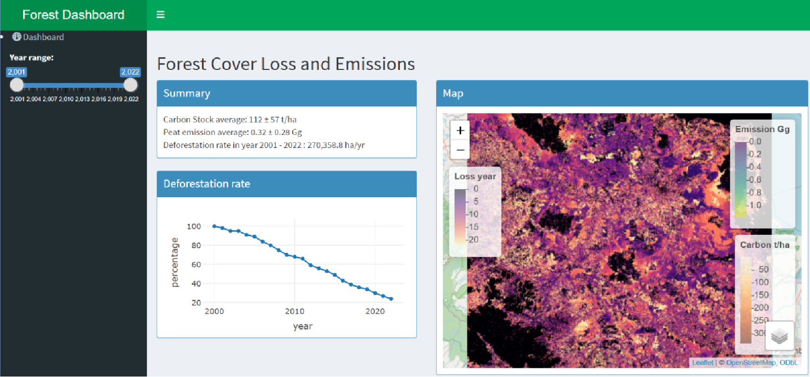

# gee-dashboard

# Download the raw raster datasets
Download them from Earth Engine using the following link:
https://code.earthengine.google.com/6595934fed943732baa3f6330ed5b313

# How to run the dashboard
1. Open gee-dashboard.R.
2. Click "Run App". The Dashboard will be running.

# File description
- data -> contains the data required to generate.
- analyze_images.ipynb -> analyze the images downloaded from Earth Engine.
- gee-dashboard.R -> the dashboard application.
- Forest Cover Loss and Emissions.pptx -> The description of the dashboard.

# Project description
This work sample exhibits a Shiny Dashboard displaying geospatial data from Google Earth Engine. There are 3 raster maps shown. They are forest cover loss year, carbon stock (t/ha), and peat carbon emission in Gigagram (emission Gg). The study area covers a part of Sumatra.

The forest loss year raster map contains the values from 1 to 22 representing the year 2001 to 2022. The value 2001 means that the forest cover was lost in 2001. The value 0 means that the forest area has not lost since 2000 or has been lost before 2000.

The carbon stock data presents the carbon stock density in tonne carbon per hectare. The carbon stock density average and standard deviation was 112 ± 57 t/ha. The denser carbon stock was found in the mountainous area on the west side.

The annual peat carbon emission is presented in the Gigagram unit. It only shows the emission of cropland in peatland areas. The emissions average and standard deviation was 0.32 ± 0.28 Gg.

# Dashboard view

Check "Forest Cover Loss and Emissions.pptx" for more details.
